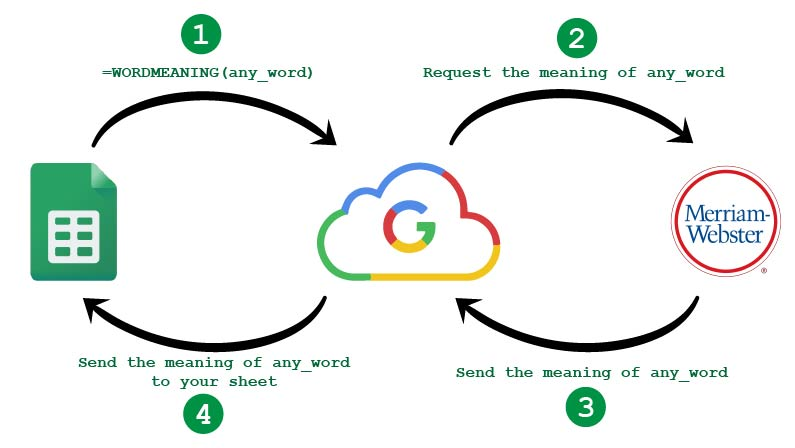

# WordMeaning
Fetch meaning of word in Google Sheets

## Problem 
Looking up words takes time

Typically, you'd keep a notebook handy to jot down unfamiliar words and their definitions as you come across them. You'd search for these meanings online (or consult a physical dictionary if you prefer the traditional approach), grasp the definitions, and record them in your notebook. This task can become quite laborious, especially when dealing with a substantial number of words, making the process increasingly cumbersome. 

## Solution 

We can use Google Sheets to fetch the meaning of the word from 3rd party API

## How does it work
Google Sheets has a script editor where you can write your custom code (Google App Script) and use it in the sheet, like a normal google sheet function.

For example, you must have used the function =SUM() to calculate the sum of a given range in an excel sheet. I’ll be using a similar approach to call a function called =WORDMEANING() which is a custom function that our code exposes to fetch the meaning from the internet using a 3rd party API.

I am using the Mirriam Webster API, to fetch the meaning of the words. It is free for personal use providing up to 1000 queries per day, and that is enough for our general use case.

## Steps to get Word Meaning in Google Sheet

1. Create an account in the Mirriam Webster API portal and get the API Key.
2. Use the API key in the code below to get the word meaning.

## Step 1 : Creating an Account in Mirriam Webster portal

Go to this link and register yourself. While you are registering, choose the “Collegiate Dictionary” in “Request API key 1” and “Collegiate Thesaurus” in “Request API key 2“.
Note: You will need to verify your account through your email.
Once you log into the account, get the Collegiate Dictionary API Key listed under the “My Keys” page and copy it into your clipboard. This is the Key you will use in the second step.

## Step 2 : 

Open a blank sheet and click on ‘Script Editor’ under the ‘Tools’ menu.

Copy-paste the code and paste it to the script editor window.
Replace “YOUR_API_KEY” in the code with the API key you got from registering yourself.
Now head back to your Google Sheet and use the function =WORDMEANING() as shown below.

Source Credits : [blog](https://yashasvisinha.com/blog/how-to-get-word-meaning-in-google-sheets/)
